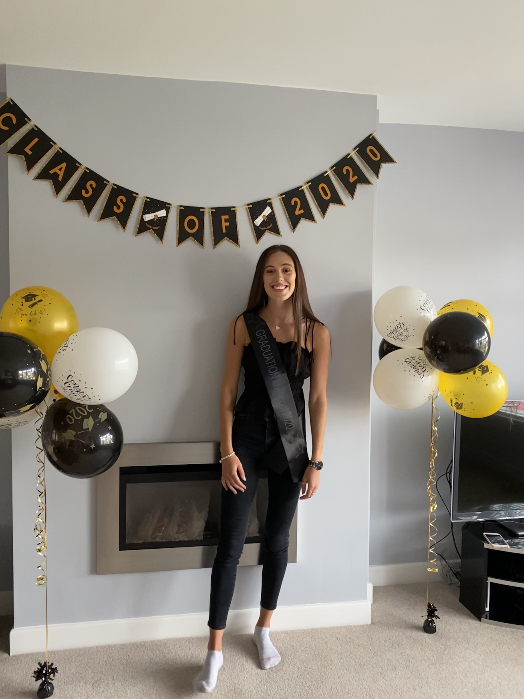

### Hello and welcome to my online portfolio. 

I am Emma Raine, a 21 year-old postgraduate student from the University of Leeds. I am currently studying for an MSc in [Geographical Information Systems](https://environment.leeds.ac.uk/courses/7411/geographical-information-systems-msc), focusing on a vast array of topics. I completed my undergraduate studies at the University of Liverpool, obtaining a BSc in [Geography](https://www.liverpool.ac.uk/study/undergraduate/courses/geography-bsc-hons/overview/), where I developed a particular interest in population change and health alongside natural hazards and climatology. 

Throughout my undergraduate and now my postgraduate education I have become a competent user of GIS (in particular ArcGIS Pro and QGIS) and numerous statistical programes (R, Minitab, SPSS). Alongside this, I am continuing to develop my knowledge of programming in my postgraduate degree, aiming to ultimately produce a final project planning the location of drunken persons movement. 

  

